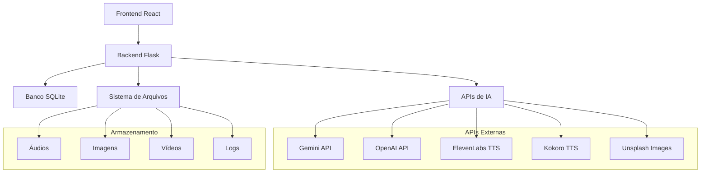
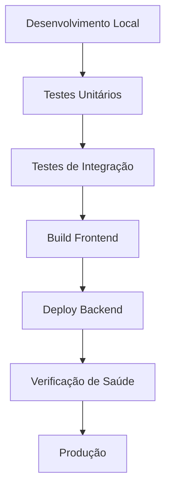
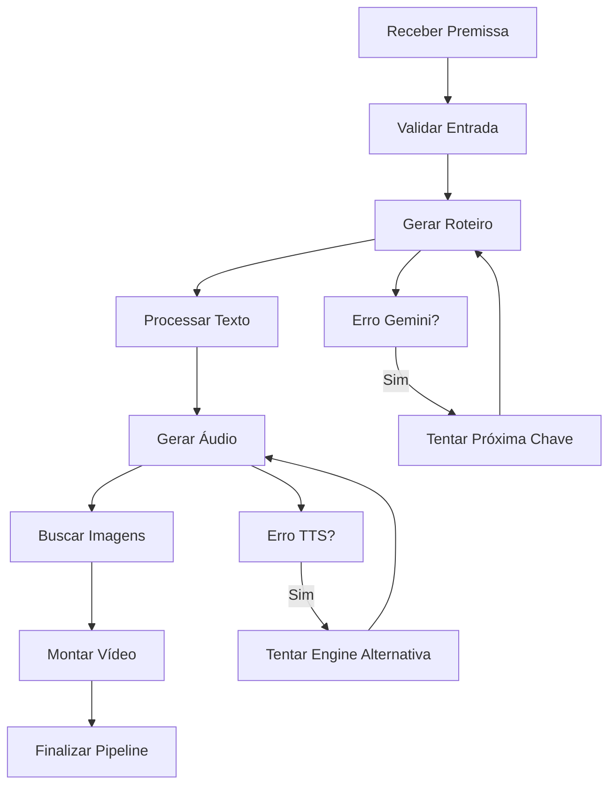

# 📋 DocView Técnico Detalhado - Auto Video Producer

## 🎯 Sumário Executivo

O **Auto Video Producer** é um sistema completo de geração automatizada de vídeos que combina inteligência artificial, processamento de texto-para-fala e geração de imagens. O projeto utiliza uma arquitetura moderna com backend Flask e frontend React, integrando múltiplas APIs de IA para criar um pipeline automatizado de produção de conteúdo.

### Características Principais

* **Pipeline Automatizado**: Processo completo de criação de vídeos

* **Integração Multi-IA**: Gemini, OpenAI, ElevenLabs, Kokoro TTS

* **Interface Web Moderna**: React com Tailwind CSS

* **Processamento Assíncrono**: Gerenciamento de tarefas em background

* **Rotação Automática de Chaves**: Sistema inteligente de gerenciamento de APIs

***

## 🏗️ Arquitetura do Sistema

### Visão Geral da Arquitetura



### Stack Tecnológico

#### Backend (Flask)

* **Framework**: Flask 3.0.0

* **Banco de Dados**: SQLAlchemy + SQLite

* **APIs de IA**:

  * Google Gemini (geração de roteiros)

  * OpenAI GPT (processamento de texto)

  * ElevenLabs (text-to-speech premium)

  * Kokoro TTS (alternativa local)

* **Processamento de Mídia**:

  * MoviePy (edição de vídeo)

  * Pillow (processamento de imagens)

  * gTTS (Google Text-to-Speech)

#### Frontend (React)

* **Framework**: React 18 + Vite

* **Estilização**: Tailwind CSS

* **Roteamento**: React Router DOM

* **HTTP Client**: Axios

* **Ícones**: Lucide React

***

## 📁 Estrutura Detalhada do Projeto

### Backend (`/backend`)

```
backend/
├── app.py                    # Aplicação principal Flask
├── database.py              # Configuração do banco de dados
├── requirements.txt         # Dependências Python
├── config/                  # Configurações
│   ├── api_keys.json       # Chaves de API (não versionado)
│   ├── agent_configs.json  # Configurações de agentes IA
│   └── prompts_config.json # Templates de prompts
├── routes/                  # Endpoints da API
│   ├── automations.py      # Automações e workflows
│   ├── pipelines.py        # Gerenciamento de pipelines
│   ├── storyteller.py      # Geração de roteiros
│   ├── images.py           # Processamento de imagens
│   ├── videos.py           # Geração de vídeos
│   └── settings.py         # Configurações do sistema
├── services/               # Serviços de negócio
│   ├── ai_services.py      # Integração com APIs de IA
│   ├── pipeline_service.py # Lógica do pipeline
│   ├── tts_service.py      # Text-to-speech
│   └── title_generator.py  # Geração de títulos
├── modules/                # Módulos específicos
├── output/                 # Arquivos gerados
│   ├── audio/             # Arquivos de áudio
│   ├── images/            # Imagens geradas
│   └── videos/            # Vídeos finais
└── tests/                  # Testes automatizados
```

### Frontend (`/frontend`)

```
frontend/
├── src/
│   ├── App.jsx             # Componente principal
│   ├── main.jsx            # Ponto de entrada
│   ├── index.css           # Estilos globais
│   ├── components/         # Componentes reutilizáveis
│   ├── pages/              # Páginas da aplicação
│   └── utils/              # Utilitários
├── public/                 # Arquivos estáticos
├── package.json            # Dependências Node.js
├── vite.config.js          # Configuração do Vite
└── tailwind.config.js      # Configuração do Tailwind
```

***

## ⚙️ Funcionalidades Detalhadas

### 1. Pipeline de Geração de Vídeos

#### Fluxo Principal

1. **Entrada de Premissa**: Usuário fornece tema/premissa
2. **Geração de Roteiro**: IA cria roteiro estruturado
3. **Processamento de Texto**: Divisão em segmentos
4. **Text-to-Speech**: Conversão para áudio
5. **Geração de Imagens**: Criação de imagens contextuais
6. **Montagem de Vídeo**: Combinação de áudio e imagens
7. **Finalização**: Vídeo pronto para uso

#### Componentes do Pipeline

* **Storyteller**: Geração inteligente de roteiros

* **TTS Engine**: Múltiplas opções de síntese de voz

* **Image Generator**: Criação automática de imagens

* **Video Composer**: Montagem final do vídeo

### 2. Sistema de Inteligência Artificial

#### Integração Gemini

* **Rotação de Chaves**: Sistema automático de alternância

* **Gerenciamento de Quota**: Controle de limites de uso

* **Retry Inteligente**: Tentativas automáticas em caso de falha

* **Contexto Longo**: Suporte a roteiros extensos

#### Processamento de Texto

* **Chunking Inteligente**: Divisão otimizada de texto

* **Remoção de Headers**: Limpeza automática de conteúdo

* **Contextualização**: Manutenção de contexto entre segmentos

### 3. Sistema de Text-to-Speech

#### Múltiplas Engines

* **ElevenLabs**: TTS premium com vozes naturais

* **Kokoro TTS**: Alternativa local e gratuita

* **Google TTS**: Fallback confiável

#### Características

* **Qualidade Adaptativa**: Seleção automática da melhor engine

* **Cache de Áudio**: Reutilização de segmentos já processados

* **Configuração Flexível**: Ajuste de velocidade, tom e estilo

### 4. Geração de Imagens

#### Fontes de Imagens

* **Unsplash API**: Imagens profissionais gratuitas

* **Geração por IA**: Integração com APIs de geração

* **Biblioteca Local**: Cache de imagens utilizadas

#### Processamento

* **Redimensionamento Automático**: Ajuste para formato de vídeo

* **Otimização**: Compressão e qualidade balanceadas

* **Sincronização**: Alinhamento com segmentos de áudio

***

## 🔄 Fluxos de Trabalho

### Workflow de Desenvolvimento



### Workflow de Pipeline



***

## 📊 Análise Técnica

### Pontos Fortes

#### 🎯 Arquitetura

* **Separação Clara**: Frontend e backend bem definidos

* **Modularidade**: Código organizado em módulos específicos

* **Escalabilidade**: Estrutura preparada para crescimento

* **Flexibilidade**: Múltiplas opções para cada serviço

#### 🚀 Funcionalidades

* **Pipeline Completo**: Processo end-to-end automatizado

* **Integração Robusta**: Múltiplas APIs de IA integradas

* **Recuperação de Falhas**: Sistema resiliente com fallbacks

* **Interface Intuitiva**: UX/UI moderna e responsiva

#### 🔧 Tecnologias

* **Stack Moderna**: Tecnologias atuais e bem suportadas

* **Performance**: Processamento assíncrono eficiente

* **Manutenibilidade**: Código bem estruturado

### Áreas de Melhoria

#### ⚠️ Organização

* **Arquivos de Teste**: Muitos arquivos de debug/teste no repositório

* **Documentação**: Falta de documentação técnica detalhada

* **Estrutura de Logs**: Sistema de logging pode ser melhorado

#### 🔒 Segurança

* **Chaves de API**: Armazenadas em arquivo JSON (não criptografadas)

* **Validação de Entrada**: Pode ser mais rigorosa

* **Rate Limiting**: Não implementado

#### 📈 Performance

* **Cache**: Sistema de cache pode ser expandido

* **Otimização de Imagens**: Processamento pode ser otimizado

* **Monitoramento**: Métricas de performance limitadas

#### 🧪 Testes

* **Cobertura**: Testes automatizados insuficientes

* **Integração**: Faltam testes de integração abrangentes

* **CI/CD**: Pipeline de deploy não automatizado

***

## 🎯 Recomendações Técnicas Prioritárias

### 🔥 Alta Prioridade

#### 1. Segurança de Chaves de API

```bash
# Migrar para variáveis de ambiente
cp backend/config/api_keys.example.json backend/config/api_keys.json
# Adicionar ao .env
echo "GEMINI_API_KEY=your_key_here" >> backend/.env
```

#### 2. Limpeza de Arquivos

```bash
# Remover arquivos de teste/debug
rm backend/test_*.py
rm backend/debug_*.py
rm backend/check_*.py
```

#### 3. Estrutura de Logs

```python
# Implementar logging estruturado
import logging
logging.basicConfig(
    level=logging.INFO,
    format='%(asctime)s - %(name)s - %(levelname)s - %(message)s',
    handlers=[
        logging.FileHandler('logs/app.log'),
        logging.StreamHandler()
    ]
)
```

### 🔶 Média Prioridade

#### 4. Sistema de Cache

```python
# Implementar Redis para cache
from flask_caching import Cache
cache = Cache(app, config={'CACHE_TYPE': 'redis'})
```

#### 5. Testes Automatizados

```python
# Estrutura de testes
tests/
├── unit/
│   ├── test_ai_services.py
│   ├── test_pipeline_service.py
│   └── test_tts_service.py
├── integration/
│   ├── test_pipeline_flow.py
│   └── test_api_endpoints.py
└── fixtures/
    └── sample_data.json
```

#### 6. Monitoramento

```python
# Implementar métricas
from prometheus_client import Counter, Histogram
pipeline_counter = Counter('pipelines_total', 'Total pipelines executed')
pipeline_duration = Histogram('pipeline_duration_seconds', 'Pipeline execution time')
```

### 🔷 Baixa Prioridade

#### 7. Containerização

```dockerfile
# Dockerfile para backend
FROM python:3.11-slim
WORKDIR /app
COPY requirements.txt .
RUN pip install -r requirements.txt
COPY . .
EXPOSE 5000
CMD ["python", "app.py"]
```

#### 8. CI/CD Pipeline

```yaml
# .github/workflows/deploy.yml
name: Deploy
on:
  push:
    branches: [main]
jobs:
  test:
    runs-on: ubuntu-latest
    steps:
      - uses: actions/checkout@v2
      - name: Run tests
        run: pytest
  deploy:
    needs: test
    runs-on: ubuntu-latest
    steps:
      - name: Deploy to production
        run: echo "Deploy script here"
```

***

## 📈 Roadmap de Implementação

### Fase 1: Segurança e Limpeza (1-2 semanas)

* [ ] Migrar chaves de API para variáveis de ambiente

* [ ] Remover arquivos de teste/debug desnecessários

* [ ] Implementar logging estruturado

* [ ] Adicionar validação de entrada mais rigorosa

### Fase 2: Otimização e Testes (2-3 semanas)

* [ ] Implementar sistema de cache

* [ ] Criar suite de testes automatizados

* [ ] Otimizar processamento de imagens

* [ ] Adicionar métricas de performance

### Fase 3: Infraestrutura (3-4 semanas)

* [ ] Containerizar aplicação

* [ ] Implementar CI/CD pipeline

* [ ] Configurar monitoramento em produção

* [ ] Documentar APIs com Swagger

### Fase 4: Funcionalidades Avançadas (4-6 semanas)

* [ ] Implementar rate limiting

* [ ] Adicionar suporte a múltiplos formatos de vídeo

* [ ] Criar dashboard de analytics

* [ ] Implementar sistema de notificações

***

## 🔍 Métricas e KPIs

### Métricas Técnicas

* **Tempo de Pipeline**: Média de 5-10 minutos por vídeo

* **Taxa de Sucesso**: \~85% (com retry

