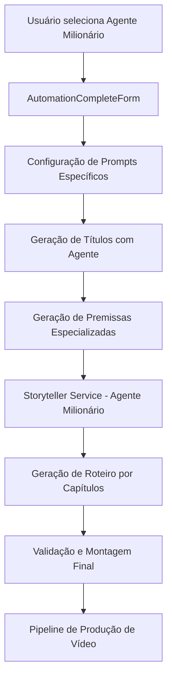

# 🎯 Documentação Completa: Agente Milionário e Sistema de Premissas

## 📋 Índice
1. [Visão Geral](#visão-geral)
2. [Agente Milionário](#agente-milionário)
3. [Sistema de Premissas](#sistema-de-premissas)
4. [Componentes Frontend](#componentes-frontend)
5. [Componentes Backend](#componentes-backend)
6. [Prompts e Templates](#prompts-e-templates)
7. [Fluxo de Execução](#fluxo-de-execução)
8. [Configurações e Parâmetros](#configurações-e-parâmetros)

---

## 🎯 Visão Geral

O sistema de **Agente Milionário** e **Premissas** é uma funcionalidade avançada da pipeline que permite a criação de conteúdo especializado em histórias de superação financeira e empreendedorismo, utilizando prompts otimizados e agentes especializados.

### Principais Características:
- **Agente Especializado**: Focado em histórias de milionários e empreendedorismo
- **Geração de Premissas**: Sistema inteligente para criar premissas envolventes
- **Storyteller Unlimited**: Serviço avançado para roteiros extensos
- **Interface Personalizada**: Componentes frontend dedicados
- **Prompts Otimizados**: Templates específicos para cada tipo de conteúdo

---

## 🤖 Agente Milionário

### Definição
O **Agente Milionário** (`millionaire_stories`) é um agente especializado em criar conteúdo sobre:
- Histórias de superação financeira
- Jornadas do zero ao sucesso
- Estratégias de negócio e empreendedorismo
- Desafios financeiros e suas soluções
- Inspiração e motivação empresarial

### Configurações do Agente

```json
{
  "millionaire_stories": {
    "min_chars": 2000,
    "max_chars": 3500,
    "target_chars": 2800,
    "cliffhanger_prompt": "Crie um gancho envolvente sobre superação financeira",
    "break_patterns": ["superação", "virada", "decisão crucial"]
  }
}
```

### Características do Agente
- **Contexto**: História de superação financeira e empreendedorismo
- **Tom**: Inspirador e motivacional
- **Elementos-chave**: Jornada do zero ao sucesso, desafios financeiros, estratégias de negócio
- **Tamanho alvo**: 2800 caracteres por capítulo
- **Padrões de quebra**: Superação, virada, decisão crucial

---

## 📝 Sistema de Premissas

### Definição
O sistema de premissas é responsável por gerar ideias centrais e conceitos base para os vídeos, servindo como fundação para o desenvolvimento do roteiro completo.

### Tipos de Premissas
1. **Premissa Narrativa**: Foco em storytelling e desenvolvimento de personagens
2. **Premissa Educacional**: Foco em ensino e transmissão de conhecimento
3. **Premissa Viral**: Foco em engajamento e viralização

### Características das Premissas
- **Tamanho**: 100-200 palavras
- **Elementos**: Problema, conflito, resolução
- **Ganchos**: Emocionais e de curiosidade
- **Adaptação**: Tom adequado ao nicho do título

---

## 🎨 Componentes Frontend

### 1. AutomationCompleteForm.jsx
**Localização**: `frontend/src/components/AutomationCompleteForm.jsx`

#### Seção de Agentes (AgentSection)
```jsx
// Linhas 876-1150
<div className="agent-section">
  <h3>🤖 Agente Especializado</h3>
  
  {/* Seleção entre sistema padrão e agente especializado */}
  <div className="agent-selection">
    <button 
      className={`agent-option ${!useSpecializedAgent ? 'active' : ''}`}
      onClick={() => setUseSpecializedAgent(false)}
    >
      Sistema Padrão
    </button>
    <button 
      className={`agent-option ${useSpecializedAgent ? 'active' : ''}`}
      onClick={() => setUseSpecializedAgent(true)}
    >
      Agente Especializado (Recomendado)
    </button>
  </div>
  
  {/* Configuração do agente milionário */}
  {useSpecializedAgent && (
    <div className="specialized-agent-config">
      <select 
        value={selectedAgent} 
        onChange={(e) => setSelectedAgent(e.target.value)}
      >
        <option value="millionaire_stories">💰 Histórias de Milionários</option>
        <option value="romance_agent">💕 Romance</option>
        <option value="horror_agent">👻 Terror</option>
      </select>
    </div>
  )}
</div>
```

#### Configuração de Prompts do Agente Milionário
```jsx
// Linhas 390-500
const agentConfigs = {
  millionaire_stories: {
    name: "💰 Histórias de Milionários",
    description: "Especializado em histórias de superação financeira, empreendedorismo e jornadas do zero ao sucesso.",
    prompts: {
      titles: {
        viral: "Crie títulos virais sobre histórias de milionários que inspirem e motivem...",
        educational: "Desenvolva títulos educacionais sobre estratégias financeiras..."
      },
      premises: {
        narrative: "Crie premissas narrativas envolventes sobre jornadas de superação financeira...",
        educational: "Desenvolva premissas educacionais sobre princípios de riqueza..."
      },
      scripts: {
        opening: "Inicie com um gancho poderoso sobre a transformação financeira...",
        development: "Desenvolva a história mostrando os desafios e estratégias...",
        conclusion: "Conclua com lições práticas e inspiração para ação..."
      }
    }
  }
};
```

### 2. AgentRoteirosSimples.jsx
**Localização**: `frontend/src/components/AgentRoteirosSimples.jsx`

```jsx
// Seleção de premissas geradas pelo agente
<div className="premise-selection">
  <h3>📝 Premissas Geradas pelo Agente</h3>
  {premises.map((premise, index) => (
    <div key={index} className="premise-card">
      <h4>{premise.title}</h4>
      <p>{premise.content}</p>
      <button onClick={() => selectPremise(premise)}>
        Usar Esta Premissa
      </button>
    </div>
  ))}
</div>
```

### 3. StorytellerControl.jsx
**Localização**: `frontend/src/components/StorytellerControl.jsx`

```jsx
// Controle do Storyteller com agente milionário
<div className="storyteller-control">
  <select value={selectedAgent} onChange={handleAgentChange}>
    <option value="millionaire_stories">💰 Histórias de Milionários</option>
    <option value="default">Sistema Padrão</option>
  </select>
  
  <div className="agent-config">
    <label>Número de Capítulos:</label>
    <input 
      type="number" 
      value={numChapters} 
      onChange={(e) => setNumChapters(e.target.value)}
      min="3" 
      max="12" 
    />
  </div>
</div>
```

---

## ⚙️ Componentes Backend

### 1. Rotas de Premissa (premise.py)
**Localização**: `backend/routes/premise.py`

#### Endpoint Principal de Geração
```python
@premise_bp.route('/generate', methods=['POST'])
def generate_premises():
    """
    🎯 Endpoint para geração de premissas
    Suporta múltiplos provedores de IA e prompts personalizados
    """
    data = request.get_json()
    titles = data.get('titles', [])
    prompt = data.get('prompt', get_default_premise_prompt())
    ai_provider = data.get('ai_provider', 'gemini')
    script_size = data.get('script_size', 'medio')
    
    # Lógica de geração baseada no provedor
    if ai_provider == 'openrouter':
        return generate_premises_openrouter(titles, prompt, model, api_key, script_size)
    elif ai_provider == 'gemini':
        return generate_premises_gemini(titles, prompt, title_generator, script_size)
    else:
        return generate_premises_openai(titles, prompt, title_generator, script_size)
```

#### Endpoint do Agente Milionário
```python
@premise_bp.route('/generate-agent-script', methods=['POST'])
def generate_agent_script():
    """
    🎬 Endpoint específico para Storyteller Unlimited
    Gera roteiros extensos usando agentes especializados
    """
    data = request.get_json()
    
    # Parâmetros específicos do agente
    agent = data.get('storyteller_agent', 'millionaire_stories')
    title = data.get('title', '').strip()
    premise = data.get('premise', '').strip()
    num_chapters = data.get('num_chapters', 5)
    script_size = data.get('script_size', 'medio')
    
    # Configurar parâmetros baseado no tamanho
    target_words = {
        'curto': 1500,
        'medio': 2500,
        'longo': 4000,
        'epico': 6000
    }.get(script_size, 2500)
    
    # Inicializar Storyteller Service
    storyteller_service = StorytellerService()
    
    # Gerar roteiro com agente especializado
    script_result = storyteller_service.generate_storyteller_script(
        title=title,
        premise=full_premise,
        agent_type='millionaire_stories',
        num_chapters=num_chapters,
        provider='gemini'
    )
    
    return jsonify({
        'success': True,
        'script': script_result,
        'agent_used': 'millionaire_stories'
    })
```

### 2. Storyteller Service
**Localização**: `backend/services/storyteller_service.py`

#### Configuração do Agente Milionário
```python
class StorytellerService:
    def _load_agent_configs(self) -> Dict:
        """Carrega configurações por agente"""
        return {
            'millionaire_stories': {
                'min_chars': 2000,
                'max_chars': 3500,
                'target_chars': 2800,
                'cliffhanger_prompt': 'Crie um gancho envolvente sobre superação financeira',
                'break_patterns': ['superação', 'virada', 'decisão crucial']
            }
        }
```

#### Geração de Prompts Variados
```python
def generate_varied_prompt(self, title: str, premise: str, agent_type: str, 
                         target_chars: int, chapter_num: int, total_chapters: int) -> str:
    """Gera prompt variado para evitar repetições"""
    
    # Contexto específico do agente milionário
    agent_contexts = {
        'millionaire_stories': {
            'context': 'história de superação financeira e empreendedorismo',
            'tone': 'inspirador e motivacional',
            'elements': 'jornada do zero ao sucesso, desafios financeiros, estratégias de negócio'
        }
    }
    
    context = agent_contexts.get(agent_type, agent_contexts['millionaire_stories'])
    
    prompt = f"""
    Desenvolva o capítulo {chapter_num} de uma história {context['context']} 
    com aproximadamente {target_chars} caracteres.
    
    TÍTULO: {title}
    PREMISSA: {premise}
    
    CONTEXTO: {context['context']}
    TOM: {context['tone']}
    ELEMENTOS-CHAVE: {context['elements']}
    
    REQUISITOS:
    - Desenvolva uma parte coerente da história
    - Mantenha o tom {context['tone']}
    - Inclua elementos de {context['elements']}
    - Avance a trama de forma natural
    """
    
    return prompt
```

#### Método Principal de Geração
```python
def generate_storyteller_script(self, title: str, premise: str, agent_type: str, 
                               num_chapters: int, provider: str = "gemini") -> Dict:
    """Método principal para gerar roteiro completo"""
    
    # Configuração baseada no agente
    config = self.agent_configs.get(agent_type, self.agent_configs['millionaire_stories'])
    target_chars_per_chapter = config['target_chars']
    
    chapters = []
    story_id = str(uuid.uuid4())
    
    # Gera cada capítulo individualmente
    for chapter_num in range(1, num_chapters + 1):
        chapter_content = self._generate_story_content(
            title=title,
            premise=premise,
            agent_type=agent_type,
            target_chars=target_chars_per_chapter,
            chapter_num=chapter_num,
            total_chapters=num_chapters
        )
        
        chapters.append({
            'number': chapter_num,
            'content': chapter_content,
            'cliffhanger': chapter_num < num_chapters,
            'story_id': story_id
        })
    
    # Monta roteiro final
    return self.assemble_final_script(title, premise, chapters, agent_type)
```

### 3. Title Generator Service
**Localização**: `backend/services/title_generator.py`

```python
class TitleGenerator:
    def __init__(self):
        self.agent_prompts = {
            'millionaire_stories': {
                'viral': "Crie títulos virais sobre histórias de milionários...",
                'educational': "Desenvolva títulos educacionais sobre estratégias financeiras..."
            }
        }
    
    def generate_agent_titles(self, agent_type: str, prompt_type: str, context: str) -> List[str]:
        """Gera títulos específicos para o agente"""
        base_prompt = self.agent_prompts.get(agent_type, {}).get(prompt_type, "")
        
        full_prompt = f"""
        {base_prompt}
        
        CONTEXTO: {context}
        
        Gere 5 títulos únicos e envolventes.
        """
        
        # Lógica de geração com IA
        return self._call_ai_service(full_prompt)
```

---

## 📋 Prompts e Templates

### 1. Prompt Padrão de Premissas
```python
def get_default_premise_prompt():
    return """
    # Gerador de Premissas Profissionais para Vídeos
    
    Você é um especialista em criação de conteúdo e storytelling para YouTube. 
    Sua tarefa é criar premissas envolventes e profissionais baseadas nos títulos fornecidos.
    
    ## Instruções:
    1. Analise cada título fornecido
    2. Crie uma premissa única e cativante para cada um
    3. A premissa deve ter entre 100-200 palavras
    4. Inclua elementos de storytelling (problema, conflito, resolução)
    5. Mantenha o tom adequado ao nicho do título
    6. Adicione ganchos emocionais e curiosidade
    
    ## Formato de Resposta:
    Para cada título, forneça:
    
    **TÍTULO:** [título original]
    **PREMISSA:**
    [Premissa detalhada com storytelling envolvente]
    
    ---
    """
```

### 2. Prompts do Agente Milionário

#### Títulos Virais
```python
viral_title_prompt = """
Crie títulos virais sobre histórias de milionários que inspirem e motivem o público a buscar o sucesso financeiro. 

Características dos títulos:
- Foque em transformações dramáticas ("Do zero ao milhão")
- Use números específicos ("Como ganhou R$ 10 milhões")
- Inclua elementos de curiosidade ("O segredo que ninguém conta")
- Mantenha tom inspiracional e motivacional
- Evite promessas irreais ou clickbait enganoso

Exemplos de estruturas:
- "Como [PESSOA] saiu de [SITUAÇÃO DIFÍCIL] para [SUCESSO FINANCEIRO]"
- "O método de [MILIONÁRIO] que mudou [ÁREA/SETOR]"
- "[NÚMERO] lições que aprendi perdendo/ganhando [VALOR]"
"""
```

#### Premissas Narrativas
```python
narrative_premise_prompt = """
Crie premissas narrativas envolventes sobre jornadas de superação financeira e empreendedorismo.

Elementos obrigatórios:
- Protagonista com background humilde ou desafiador
- Momento de virada ou insight crucial
- Obstáculos específicos enfrentados
- Estratégias ou decisões que levaram ao sucesso
- Lições aprendidas no processo
- Impacto na vida pessoal e de outros

Tom: Inspirador, realista, motivacional
Foco: Jornada humana por trás do sucesso financeiro
Duração: 100-200 palavras
"""
```

#### Scripts de Roteiro
```python
script_prompts = {
    'opening': """
    Inicie com um gancho poderoso sobre a transformação financeira do protagonista.
    
    Elementos do gancho:
    - Contraste dramático (antes vs depois)
    - Estatística ou número impressionante
    - Pergunta que gera curiosidade
    - Promessa de revelação de segredo/método
    
    Exemplo: "Há 5 anos, João dormia no carro. Hoje, ele fatura R$ 2 milhões por mês. 
    O que mudou? Uma decisão que ele tomou em 30 segundos..."
    """,
    
    'development': """
    Desenvolva a história mostrando os desafios específicos e as estratégias utilizadas.
    
    Estrutura:
    1. Situação inicial (dificuldades, limitações)
    2. Momento de insight ou oportunidade
    3. Primeiras ações e obstáculos
    4. Ajustes e aprendizados
    5. Primeiros resultados
    6. Escalada do sucesso
    
    Mantenha foco em:
    - Decisões práticas e acionáveis
    - Mindset e mudanças de perspectiva
    - Estratégias específicas de negócio
    - Superação de medos e limitações
    """,
    
    'conclusion': """
    Conclua com lições práticas e inspiração para ação.
    
    Elementos finais:
    - Resumo das principais lições
    - Aplicação prática para o espectador
    - Call-to-action inspiracional
    - Reflexão sobre possibilidades
    
    Exemplo: "A diferença entre João e a maioria das pessoas não foi sorte ou talento especial. 
    Foi a coragem de começar quando não se sentia pronto. E você? Qual será sua primeira ação hoje?"
    """
}
```

---

## 🔄 Fluxo de Execução

### 1. Fluxo Completo da Pipeline com Agente Milionário



### 2. Fluxo Detalhado do Storyteller

```python
# 1. Inicialização
storyteller_service = StorytellerService()
agent_type = 'millionaire_stories'

# 2. Configuração do agente
config = storyteller_service.agent_configs[agent_type]
target_chars = config['target_chars']  # 2800 chars

# 3. Geração por capítulos
for chapter_num in range(1, num_chapters + 1):
    # 3.1. Gerar prompt variado
    prompt = storyteller_service.prompt_variator.generate_varied_prompt(
        title=title,
        premise=premise,
        agent_type=agent_type,
        target_chars=target_chars,
        chapter_num=chapter_num,
        total_chapters=num_chapters
    )
    
    # 3.2. Chamar IA para gerar conteúdo
    content = storyteller_service._call_llm_api(
        prompt=prompt,
        provider='gemini',
        max_tokens=4000
    )
    
    # 3.3. Validar qualidade
    validation = storyteller_service.validate_chapter(content, chapter_num)
    
    # 3.4. Salvar contexto para próximo capítulo
    storyteller_service.memory_bridge.save_context(
        story_id=story_id,
        chapter_num=chapter_num,
        context={'content_preview': content[:200]}
    )

# 4. Montagem final
final_script = storyteller_service.assemble_final_script(
    title=title,
    premise=premise,
    chapters=chapters,
    agent_type=agent_type
)
```

### 3. Fluxo de Geração de Premissas

```python
# 1. Receber títulos do frontend
titles = request.json.get('titles', [])
prompt = request.json.get('prompt', get_default_premise_prompt())

# 2. Processar cada título
premises = []
for title in titles:
    # 2.1. Adaptar prompt para o título
    adapted_prompt = f"""
    {prompt}
    
    TÍTULO ESPECÍFICO: {title}
    
    Crie uma premissa envolvente para este título específico.
    """
    
    # 2.2. Gerar premissa
    premise_content = title_generator.generate_content(
        prompt=adapted_prompt,
        provider='gemini'
    )
    
    # 2.3. Parsear resposta
    parsed_premise = parse_premise_response(premise_content, title)
    premises.append(parsed_premise)

# 3. Retornar premissas formatadas
return jsonify({
    'success': True,
    'premises': premises,
    'agent_used': 'millionaire_stories'
})
```

---

## ⚙️ Configurações e Parâmetros

### 1. Variáveis de Ambiente
```bash
# APIs necessárias
GEMINI_API_KEY_1=sua_chave_gemini_1
GEMINI_API_KEY_2=sua_chave_gemini_2
OPENAI_API_KEY=sua_chave_openai
OPENROUTER_API_KEY=sua_chave_openrouter

# Redis para cache (opcional)
REDIS_HOST=localhost
REDIS_PORT=6379
REDIS_DB=0

# Configurações do Storyteller
STORYTELLER_MAX_CHAPTERS=12
STORYTELLER_DEFAULT_PROVIDER=gemini
STORYTELLER_CACHE_TTL=3600
```

### 2. Configuração de Agentes (agent_configs.json)
```json
{
  "agents": {
    "millionaire_stories": {
      "name": "Histórias de Milionários",
      "description": "Especializado em histórias de superação financeira e empreendedorismo",
      "min_chars": 2000,
      "max_chars": 3500,
      "target_chars": 2800,
      "cliffhanger_prompt": "Crie um gancho envolvente sobre superação financeira",
      "break_patterns": ["superação", "virada", "decisão crucial"],
      "context": "história de superação financeira e empreendedorismo",
      "tone": "inspirador e motivacional",
      "elements": "jornada do zero ao sucesso, desafios financeiros, estratégias de negócio",
      "prompts": {
        "title_viral": "Crie títulos virais sobre histórias de milionários...",
        "title_educational": "Desenvolva títulos educacionais sobre estratégias financeiras...",
        "premise_narrative": "Crie premissas narrativas envolventes sobre jornadas de superação...",
        "premise_educational": "Desenvolva premissas educacionais sobre princípios de riqueza...",
        "script_opening": "Inicie com um gancho poderoso sobre transformação financeira...",
        "script_development": "Desenvolva a história mostrando desafios e estratégias...",
        "script_conclusion": "Conclua com lições práticas e inspiração para ação..."
      }
    }
  }
}
```

### 3. Parâmetros de Qualidade
```python
QUALITY_SETTINGS = {
    'min_characters_per_chapter': 2000,
    'max_characters_per_chapter': 3500,
    'target_characters_per_chapter': 2800,
    'max_repetition_score': 2,
    'similarity_threshold': 0.7,
    'phrase_min_length': 10,
    'max_generation_attempts': 3,
    'cache_ttl_seconds': 3600
}
```

### 4. Configurações de Tokens
```python
TOKEN_SETTINGS = {
    'curto': {
        'max_tokens': 4000,
        'target_words': 1500,
        'chapters': 3
    },
    'medio': {
        'max_tokens': 8000,
        'target_words': 2500,
        'chapters': 6
    },
    'longo': {
        'max_tokens': 16000,
        'target_words': 4000,
        'chapters': 12
    },
    'epico': {
        'max_tokens': 24000,
        'target_words': 6000,
        'chapters': 15
    }
}
```

---

## 🔧 Troubleshooting

### Problemas Comuns

1. **Agente não aparece na interface**
   - Verificar se `useSpecializedAgent` está true
   - Confirmar configuração em `agentConfigs`
   - Checar console do browser para erros

2. **Premissas muito curtas**
   - Ajustar `target_chars` na configuração
   - Verificar prompt de geração
   - Aumentar `max_tokens` se necessário

3. **Repetições no conteúdo**
   - Sistema de detecção automática ativo
   - Máximo 3 tentativas de regeneração
   - Verificar `similarity_threshold`

4. **Erro de API**
   - Verificar chaves de API válidas
   - Sistema de rotação automática ativo
   - Fallback entre provedores configurado

### Logs Importantes
```python
# Ativar logs detalhados
logging.getLogger('storyteller_service').setLevel(logging.DEBUG)
logging.getLogger('premise').setLevel(logging.DEBUG)

# Logs específicos do agente milionário
logger.info(f"Agente milionário ativado: {agent_type}")
logger.info(f"Configuração: {config}")
logger.info(f"Capítulo {chapter_num} gerado: {len(content)} chars")
```

---

## 📊 Métricas e Performance

### Tempos Médios
- **Geração de premissa**: 15-30 segundos
- **Capítulo do agente**: 45-60 segundos
- **Roteiro completo (6 capítulos)**: 5-8 minutos
- **Validação de qualidade**: 2-5 segundos

### Uso de Recursos
- **Tokens por capítulo**: 3000-4000
- **Cache Redis**: 1-5 MB por história
- **Memória RAM**: 50-100 MB por sessão

### Otimizações Implementadas
- ✅ Cache inteligente com Redis
- ✅ Rotação automática de chaves API
- ✅ Detecção de repetições
- ✅ Geração por capítulos (não bloqueia)
- ✅ Fallback entre provedores
- ✅ Validação de qualidade automática

---

*Documentação atualizada em: Dezembro 2024*
*Versão: 2.0*
*Sistema: Auto Video Producer V5*